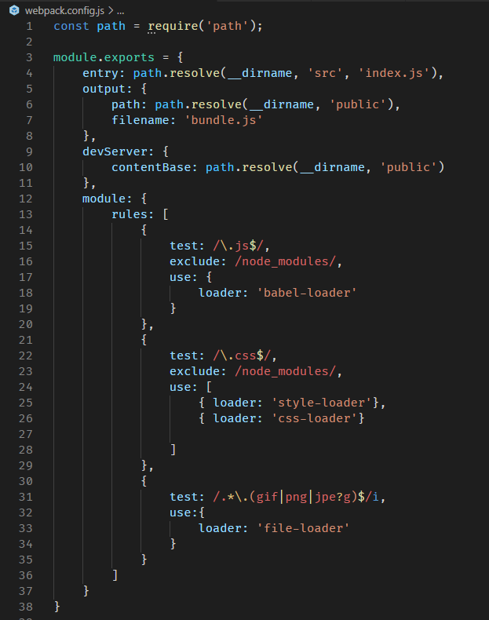

# conceitos_reactjs
Conceitos iniciais de ReacJS

[](https://img.shields.io/node/v/react)
<br>

## Conceitos estudados
- Babel
- Webpack
- Componentização
- UseState
- UseEffect
- Axios (integração com API)

## Curiosidades

Um dos conceitos mais legais que aprendi nesse módulo, foi como configurar um projeto react do zero, sem depender do 'create-react-app'. 
Dessa forma foi possível entender conceitos do babel, configurações do webpack passo a passo. Abaixo é possível ver como ficou a estrutura do webpack após realizar algumas configurações, por exemplo para o react aceitar que importemos imagens dentro do js.
> Esse arquivo está no caminho './frontend/webpack.config.js'
<p align="center">
  
</p>


## Requisitos de instalação
- npm >= 6.0.0
- node >= 10

## Como utilizar

### Web

#### Execute o comando para ir para o diretório do desafio, que é onde consta mais funcionalidades com API:

```
cd desafio
```

#### Execute o comando para instalações de dependências do web:

```
yarn
```

#### Iniciar o site:
> Para rodar a API junto, <a href="https://github.com/tsunodajapa/conceitos_node">clique aqui<a/> para acessar o repositório da API

```
yarn dev
```


